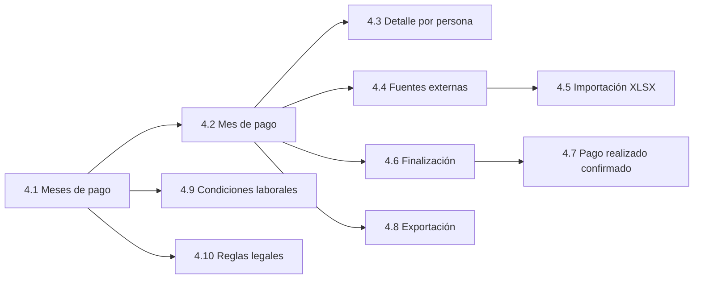

# Diseño de interacción de Pagos

Estado: aprobado por Diego el 2026-10-05, con las decisiones de producto de la sección 9. Las secciones 4.9 y 4.10 (condiciones laborales y reglas legales), 6.6, 6.7 y V7 se añadieron después de esa aprobación y esperan su revisión. Fuente de alcance: [issue #96](https://github.com/diego-valdettaro/gestor-planilla-patty/issues/96). Ticket que lo produce: [issue #106](https://github.com/diego-valdettaro/gestor-planilla-patty/issues/106).

Este documento describe cómo se usan las pantallas de Pagos antes de construirlas. No añade roles ni capacidades por su cuenta: lo que no está en #96, en [`diseno-software-pagos.md`](diseno-software-pagos.md) o en los ADR 0007, 0009, 0012, 0013 y 0014 se preguntó a Diego y consta como decisión en la sección 9; lo que obliga a actualizar la especificación se lista allí como consecuencia abierta. Usa el vocabulario de [`CONTEXT.md`](../CONTEXT.md) y el contrato visual de [`agents/diseno.md`](agents/diseno.md).

## 1. Punto de partida

### 1.1 Qué se tomó de la app actual

Se revisó el código de las pantallas existentes (`/periodos`, `/asistencias`, `/configuracion`, `/turnos`), `src/app/global.css` y las capturas de QA ya versionadas (`docs/qa/issue-99-periodos-1280.png`, `issue-99-periodos-375.png`, `issue-103-periodos-admin.png`). Pagos reutiliza estos elementos tal como existen:

| Elemento | Dónde existe hoy | Uso en Pagos |
| --- | --- | --- |
| Navegación lateral y, hasta 900 px, barra superior con botón de menú | `navegacion.tsx`, `.navegacion` | Un acceso nuevo, visible solo para Finanzas. |
| Cabecera de página: `.eyebrow`, `h1`, párrafo de ayuda | `/periodos` | Todas las pantallas de Pagos. |
| `.panel`, `.panel-cabecera`, `.panel-filtros`, `.panel-tabla` | `/periodos`, `/configuracion` | Contenedores de resumen, criterios y tablas. |
| `.insignia ok` / `.insignia neutro` | `/periodos` (Abierto / Cerrado) | Estados del mes y de cada fuente. Se añaden variantes (ver 8). |
| `.mensaje-operacion` con `listo`, `advertencia`, `error` y `role="status"`/`role="alert"` | `/periodos`, importación | Bloqueos, éxitos y errores junto a su acción. |
| `.estado-vacio` | `/periodos`, páginas «Sin permiso» | Estados vacíos y sin permiso. |
| `BotonDeAccionConfirmada` y `.dialogo-confirmacion` (`<dialog>` nativo, título, Cancelar y Confirmar) | cerrar y reabrir período, decidir horas extra | Diálogos de finalizar y confirmar pago. |
| Importación con vista previa y confirmación de lo que se reemplazaría | `/asistencias/importar` | Importación del XLSX de fuentes externas. |
| Botón principal `.boton-principal`, secundario `.boton-secundario`, destructivo `.peligro` | global | Una sola acción principal por contexto. |
| Primera columna fija dentro de una tabla con desplazamiento horizontal | `.tabla-plan-semanal` en Horarios | Tablas de personas en ancho estrecho (ver 8, variante V2). |

### 1.2 Lo que la app actual no tiene

- No hay estados de **cargando** ni de **error de carga**: las páginas se renderizan en el servidor (`force-dynamic`), no existen `loading` ni `error` de ruta y los errores solo se muestran en la acción que los produjo. Pagos necesita ambos (criterio de #106) y se documenta como variante V1.
- No hay formato de importes monetarios: hoy solo hay minutos y conteos. El contrato visual ya fija `S/ 120,00` como unidad.
- La maqueta de `propuesta-visual` que mencionaba el ticket no existe; Diego confirmó el 2026-10-05 que no hay tal maqueta (D1). Este diseño parte solo de las pantallas reales, el contrato visual y #96.

## 2. Principios transversales

1. **Solo Finanzas.** Importes, bases, fuentes, finalización y exportación son visibles únicamente para Finanzas (#96, historia 2). Los demás roles no ven el acceso en la navegación y, si llegan por URL, ven «Sin permiso» (sección 3). Los permisos se comprueban en el servidor, nunca por filtros de interfaz.
2. **Objeto, estado, resumen, detalle.** Cada pantalla abre con qué se revisa y en qué estado está; sigue con criterios de consulta, resumen con totales y bloqueos, y detalle (contrato visual, «Jerarquía y datos»).
3. **Tres tiempos siempre separados.** Ninguna cifra se rotula solo como «mes». Las pantallas distinguen **mes de pago**, **corte de incidencias** (26 al 25) y **mes de devengue**. Un importe de otro mes de devengue lo dice con texto en su fila (por ejemplo «Devengue: 09/2026, se aplica en 10/2026»).
4. **Alcance rotulado.** Cada cifra indica si cubre a todas las personas del mes o solo las filtradas («Totales del mes completo», «Totales de las 3 personas filtradas»), como ya hace `/periodos`.
5. **Unidades y alineación.** Importes `S/ 1.234,56`, minutos `45 min`, días `2 días`. Cifras alineadas a la derecha; encabezado con unidad.
6. **Faltante no es cero.** Una celda sin dato muestra «Pendiente» (texto, con insignia), nunca `S/ 0,00`. Un cero aparece solo cuando es un cero calculado o una fuente confirmada (#96, historia 27).
7. **Borrador no es definitivo.** Mientras no haya versión finalizada, el neto de una persona con bloqueos no se muestra como definitivo; se muestra «Incompleto» y las líneas calculables (ADR 0014).
8. **Estado con texto.** Todo estado va con texto además de color. Todo bloqueo dice causa y siguiente paso permitido.
9. **No se editan líneas calculadas.** Ninguna celda del detalle es editable. La corrección se hace en la fuente o con un ajuste de preliquidación (ADR 0009); el detalle solo enlaza a ese destino.
10. **Pagos no ejecuta pagos.** Ningún texto sugiere transferencia, boleta, PLAME ni archivo de banco. «Pago realizado confirmado» es una constancia.

## 3. Estados comunes a todas las pantallas

Cada pantalla de la sección 4 hereda estos seis estados y solo detalla lo que cambia.

| Estado | Comportamiento |
| --- | --- |
| Normal | Contenido y acciones según el rol Finanzas y el estado del mes. |
| Vacío | `.estado-vacio` con título que dice qué falta y un único siguiente paso. Nunca una tabla sin filas. |
| Cargando | Cabecera y criterios visibles, y en lugar del contenido un esqueleto con el texto «Calculando…» (`role="status"`). Si el cálculo tarda, el texto no cambia; no hay barra de progreso inventada (V1). |
| Error | Panel `.mensaje-operacion error` con `role="alert"`, qué falló en una frase, y botón «Reintentar». Los datos mostrados antes no se conservan como válidos. Un error de una acción (importar, finalizar) se muestra junto a esa acción y no reemplaza la pantalla. |
| Sin permiso | `<main class="centrado">` con `.estado-vacio`: «Sin permiso. Su rol no permite consultar Pagos.» Sin acciones. Mismo patrón que las demás rutas. |
| Deshabilitado | Un control no disponible permanece visible, `disabled`, con la causa en texto contiguo (no solo en tooltip). Ejemplo: «Finalizar» deshabilitado con «Hay 3 bloqueos del mes». |

**Ancho estrecho (hasta 900 px, verificado también a 375 px).** La navegación pasa a barra superior. El contenido ocupa todo el ancho con 16 px de margen. Los criterios (`.panel-filtros`) pasan a una columna. Las tablas conservan sus columnas y se desplazan horizontalmente dentro de su `.panel-tabla`, sin ensanchar la página; la página no tiene desplazamiento horizontal. Las acciones de una cabecera se apilan debajo del título, la acción principal primero. Los diálogos usan `calc(100% - 2rem)` de ancho y sus botones se apilan con Confirmar arriba y Cancelar abajo (V3).

## 4. Pantallas

Las referencias «(Dn)» remiten a la decisión correspondiente de la sección 9.

Estructura de páginas (D2): un acceso «Pagos» en la navegación abre la lista de meses (4.1); cada mes tiene su propia página (4.2) y el detalle por persona es otra página enlazable dentro de ese mes (4.3). Las fuentes externas, la importación, la finalización, la constancia de pago y la exportación se alcanzan desde la página del mes. Las condiciones laborales con vigencia (4.9) y las reglas legales (4.10) también son secciones de Pagos, visibles solo para Finanzas, y se alcanzan desde la navegación secundaria de Pagos (V7); si son un panel, una subpágina o un diálogo lo decide el ticket que las construya, respetando lo descrito aquí. Las URL exactas también las fija el primer ticket con interfaz: el ticket #116 fijó `/pagos` (redirige a la primera sección disponible), `/pagos/condiciones-laborales` y `/pagos/condiciones-laborales/[relacionId]`; el ticket #117 añadió `/pagos/reglas-legales` (lista de valores legales) y `/pagos/reglas-legales/[codigo]` (historial de un valor, consulta por fecha, activación y corrección); el ticket #118 añadió `/pagos/fuentes-externas?mes=AAAA-MM` (tipos de fuente del mes de pago con su estado) y `/pagos/fuentes-externas/[tipo]?mes=AAAA-MM` (filas, carga manual, anulación y confirmación de un tipo), mientras no exista la página del mes; el ticket #119 añadió `/pagos/fuentes-externas/importar?mes=AAAA-MM&tipo=<codigo>` (validar e importar un archivo fuente) y `/pagos/fuentes-externas/plantilla?tipo=<codigo>` (descarga de la plantilla normalizada, solo Finanzas); los tickets siguientes cuelgan sus pantallas de `/pagos`. Los enlaces entre pantallas se describen por nombre.

### 4.1 Lista de meses de pago

**Para qué sirve.** Elegir el mes de pago a revisar y ver de un vistazo en qué estado está cada uno.

**Orden del contenido.**
1. Cabecera: eyebrow «Finanzas», título «Pagos», ayuda «Revise la preliquidación de cada mes de pago.».
2. `.panel-tabla` «Meses de pago», un mes por fila, el más reciente primero.

| Columna | Contenido |
| --- | --- |
| Mes de pago | `10/2026` (enlace a 4.2). |
| Corte de incidencias | `26/09/2026 al 25/10/2026`. |
| Estado | Insignia con texto: «Borrador», «Finalizada (versión 2)», «Pago realizado confirmado». |
| Bloqueos | Conteo, por ejemplo `3 bloqueos`, o «Sin bloqueos». Vacío si ya está finalizada. |
| Personas (n.º) | Número de personas incluidas por su relación laboral. |
| Neto total | `S/ 48.210,35` si hay versión finalizada; «Incompleto» si es borrador con bloqueos. |

Acción por fila: solo el enlace del mes. No hay acciones de cambio en la lista.

**Estados específicos.**
- *Vacío:* «Todavía no hay meses de pago. Un mes aparece cuando existe al menos una relación laboral confirmada por Recursos Humanos dentro de su corte.» No se ofrece crear meses a mano (D3).
- *Deshabilitado:* la lista no tiene acciones de cambio, así que no hay controles que deshabilitar; un mes siempre se puede abrir en consulta.
- *Cargando, error y sin permiso:* según la sección 3. En error, «No se pudo cargar la lista de meses de pago.» con «Reintentar».
- *Ancho estrecho:* tabla con desplazamiento; la primera columna (Mes de pago) queda fija (V2).

### 4.2 Mes de pago

**Para qué sirve.** Es la pantalla de trabajo de Finanzas: ver qué impide finalizar, qué fuentes faltan y cuánto suma el mes.

**Orden del contenido** (contrato visual: objeto, estado, criterios, resumen y bloqueos, detalle).

1. **Cabecera del objeto.** Título «Mes de pago 10/2026». Debajo, tres datos con rótulo: «Corte de incidencias: 26/09 al 25/10», «Revisiones de asistencia: 2 períodos cerrados» (con enlace a cada período) y la insignia de estado («Borrador», «Finalizada, versión 2», «Pago realizado confirmado»). A la derecha, la **única acción principal del contexto**: «Finalizar mes» en borrador; «Confirmar pago realizado» en finalizada sin pago; ninguna cuando el pago realizado ya está confirmado. «Exportar XLSX» es acción secundaria (4.8).
2. **Panel «Bloqueos del mes».** Ver 5. Si no hay: `.mensaje-operacion listo` «El mes no tiene bloqueos. Puede finalizarlo.». Los bloqueos del mes aparecen antes que los de personas.
3. **Panel «Fuentes externas».** Una fila por tipo de fuente con su estado (resumen de 4.4), con enlace «Revisar fuente».
4. **Criterios.** `.panel-filtros`: Sede de adscripción, Grupo operativo y Persona (nombre o DNI). Estos criterios cambian la tabla de personas, no los totales.
5. **Totales del mes completo.** `.panel-tabla` de una fila: ingresos remunerativos, ingresos no remunerativos, reducciones, deducciones del trabajador, **neto** y aportes patronales (EsSalud). Cada columna con `S/`. Si hay bloqueos, «Incompleto» y una nota que indica cuántas personas tienen bloqueos (D18).
6. **Imputación por sede de adscripción.** `.panel-tabla` con una fila por sede (Taller, Administración, tiendas) y las mismas columnas de totales. Rótulo «Por sede de adscripción»; no se llama «centro de costo» (CONTEXT.md).
7. **Personas del mes.** `.panel-tabla`, una fila por persona.

| Columna | Contenido |
| --- | --- |
| Persona | Nombre y DNI (enlace a 4.3). Fija en ancho estrecho. |
| Grupo / sede de adscripción | Dos líneas de texto. |
| Ingresos | `S/` |
| Reducciones | `S/` |
| Deducciones | `S/` |
| Neto | `S/` o «Incompleto». |
| Estado | «Calculada» o «Bloqueada» (con el motivo corto: «Neto negativo»). |

Debajo de las personas hay un bloque «Historial de versiones» (solo si existe alguna versión finalizada): una fila por versión con número, fecha, responsable y estado («Reemplazada», «Vigente», «Pago realizado confirmado»). Cada fila abre esa versión completa, con su detalle por persona, en solo lectura (D15).

**Estados específicos.**
- *Vacío:* si el mes no tiene personas incluidas, `.estado-vacio` «Este mes no incluye personas. Revise las relaciones laborales confirmadas por Recursos Humanos.».
- *Cargando:* el cálculo del borrador se hace al abrir la pantalla; mientras tanto se muestra la cabecera y «Calculando preliquidación…».
- *Error:* «No se pudo calcular la preliquidación del mes. No se guardó nada.» con «Reintentar».
- *Deshabilitado:* «Finalizar mes» deshabilitado mientras haya bloqueos del mes o de alguna persona, con el texto «Resuelva los N bloqueos para finalizar». En un mes con pago confirmado, «Finalizar mes» no se muestra y se explica en texto: «Este mes ya tiene su pago realizado confirmado; no admite una nueva versión.» (ADR 0013).
- *Mes con pago realizado confirmado:* toda la pantalla pasa a solo consulta. Las fuentes y la importación se muestran sin acciones.
- *Ancho estrecho:* el orden se mantiene. La acción principal baja debajo del título y ocupa el ancho. Los totales y las personas se desplazan horizontalmente con la primera columna fija.

### 4.3 Detalle por persona

**Para qué sirve.** Explicar cómo se llegó al neto (#96, historia 3): cada importe, de dónde sale y con qué base.

**Orden del contenido.**
1. **Objeto.** Nombre, DNI, grupo operativo, sede de adscripción, régimen laboral vigente, fechas de la relación laboral. Estado de la persona: «Calculada» o «Bloqueada». Enlace «Volver al mes de pago».
2. **Bloqueos de la persona** (si hay), con causa y siguiente paso (5).
3. **Resumen.** `.panel-tabla` de una fila: ingresos, reducciones, deducciones, **neto**, aportes patronales.
4. **Conceptos.** `.panel-tabla` agrupada en cinco encabezados de sección: *Ingresos remunerativos*, *Ingresos no remunerativos*, *Reducciones de remuneración*, *Deducciones del trabajador*, *Aportes del empleador*. Columnas:

| Columna | Contenido |
| --- | --- |
| Concepto | Nombre del catálogo (por ejemplo «Hora extra 25 %», «Tardanza real»). |
| Cantidad | `2 días`, `95 min`. Vacío si no aplica. |
| Mes de devengue | `09/2026`. Si difiere del mes de pago, se destaca con texto «Devengue anterior». |
| Origen | «Calculado desde asistencia», «Fuente externa: Comisiones», «Ajuste de preliquidación». |
| Importe | `S/`, con signo según su efecto sobre el neto. |

Cada fila tiene «Ver base», que despliega con `
` el cálculo: valor diario o valor hora usado, jornada ordinaria diaria, fechas o minutos y regla aplicada. Para los conceptos que vienen de asistencia incluye el enlace «Ver jornada» a la asistencia de origen.

5. **Bases.** `.panel-tabla` con cuatro filas independientes: base pensionaria, base de EsSalud, base de quinta categoría y remuneración ordinaria computable. Nota fija bajo la tabla: «La movilidad supeditada a asistencia integra la base de quinta categoría, pero no las bases pensionaria ni de EsSalud.». La retención de quinta aparece como concepto «externo»; la aplicación calcula la base, no la retención.
6. **Vacaciones del mes** (solo si la persona tiene descanso vacacional que toca el mes). Tabla por mes calendario: días de descanso vacacional del mes, remuneración vacacional, abonos anticipados asignados y saldo a entregar. Debe mostrar los meses de origen y destino aunque el desembolso haya sido en otro mes.
7. **Imputación.** Línea de texto: «Imputado a la sede de adscripción Tiendas Benavides». Se distingue de «Sede de la jornada» en el detalle diario.

**Estados específicos.**
- *Vacío:* persona sin ninguna línea porque su relación laboral solo toca el mes por días pendientes de otro mes: `.estado-vacio` «Sin conceptos en este mes de pago. Sus días se pagan en otro mes de pago.» con el mes.
- *Error:* «No se pudo calcular a esta persona.» con «Reintentar» y «Volver al mes de pago». No oculta al resto del mes.
- *Deshabilitado:* no hay acciones de edición. Las acciones de corrección son enlaces («Ir a fuente», «Registrar ajuste») y se deshabilitan con causa en un mes con pago realizado confirmado.
- *Ancho estrecho:* la tabla de conceptos mantiene sus columnas; la columna Concepto queda fija; «Ver base» sigue siendo un `
` dentro de la fila (no un panel lateral). Las bases se muestran como lista de pares rótulo/valor en una columna.

### 4.4 Fuentes pendientes y su confirmación

**Para qué sirve.** Distinguir un cero confirmado de un dato pendiente (#96, historia 27).

**Orden del contenido.**
1. Título «Fuentes externas del mes de pago 10/2026» y el recordatorio «Una persona sin fila cuenta como cero solo cuando confirma el tipo de fuente.».
2. **Tabla de tipos de fuente**, una fila por tipo (comisiones de ventas, movilidad supeditada a asistencia, adelantos, préstamos, incidencias de tienda, retención de quinta categoría, gratificación legal y bonificación extraordinaria, conciliación de liquidación por cese, ajustes de preliquidación, abonos anticipados de remuneración vacacional, descansos sustitutorios previstos y los demás del catálogo ADR 0009 (D12)).

| Columna | Contenido |
| --- | --- |
| Tipo de fuente | Nombre. |
| Estado | «Pendiente», «Confirmada con importes», «Confirmada sin importes». |
| Filas (n.º) | Conteo de conceptos cargados. |
| Importe total | `S/` |
| Último archivo fuente | Nombre, fecha y responsable, o «Carga manual». |
| Acciones | «Ver filas», «Importar XLSX» (4.5), «Confirmar listado completo». |

3. **Detalle de un tipo** (al elegir «Ver filas»): tabla de conceptos con Persona (DNI), Fecha del hecho, Mes de devengue, Mes de aplicación, Importe, Origen. Las filas duplicadas o inválidas se marcan con texto, no se suman y bloquean a su persona hasta corregir la fuente (D6, 5.2).

**Confirmar listado completo.** Acción secundaria por fila. Abre un diálogo (6.3). En una fuente sin filas el botón dice «Confirmar sin importes» y el diálogo lo dice. Una fuente confirmada muestra la insignia «Confirmada» con fecha y responsable; mientras el mes no esté finalizado ofrece «Volver a pendiente» con un diálogo (6.5, D4). Cualquier cambio de filas de un tipo confirmado, incluida una importación nueva, lo devuelve a «Pendiente» (D5).

**Alcance de #118.** El ticket #118 construye la tabla de tipos de fuente, la carga manual de importes, «Anular» con motivo (es la forma de corregir una fila: se anula y se vuelve a registrar), «Confirmar listado completo» / «Confirmar sin importes» y «Volver a pendiente». Los tipos de fuente que ofrece son los genéricos de importe: comisiones de ventas, movilidad supeditada a asistencia, adelantos, préstamos (cuotas), retención de quinta categoría, y gratificación legal con bonificación extraordinaria. Cada ticket con un flujo propio agrega su tipo al catálogo: incidencias de tienda y ajustes de preliquidación (#120), abonos anticipados de remuneración vacacional y descansos sustitutorios previstos (#125, #124) y la conciliación de la liquidación por cese (#128). La carga manual rechaza un importe duplicado (misma persona, concepto, fecha del hecho, mes de devengue, mes de aplicación y monto) y cualquier concepto de origen calculado: esas líneas se corrigen en su fuente o con un ajuste. «Importar XLSX» y la plantilla las añadió #119: el archivo es la hoja «Importes» con las columnas DNI, Concepto (código o nombre del catálogo, solo los del tipo), Fecha del hecho, Mes de devengue e Importe; el mes de aplicación es el mes de pago elegido. Importar el mismo archivo (mismo hash) otra vez se rechaza mientras conserve filas vigentes. Un archivo importado conserva su hash, responsable, tipo, mes y los conteos de la validación, y sus filas llevan la procedencia «Archivo <nombre>».

**Incidencias de tienda.** Cada incidencia muestra su estado con texto: «Sin sustento», «En investigación (fuera del neto)», «Descuento autorizado». Solo «Descuento autorizado» llega al neto. «En investigación» se marca con la acción «No descontar en este pago» y no bloquea al resto del personal (ADR 0009). Para pasar a «Descuento autorizado» Finanzas registra un texto de sustento, quién autoriza y la fecha de la autorización; no hay adjuntos en este incremento (D7).

**Estados específicos.**
- *Vacío:* el catálogo tiene tipos aunque no haya filas; no hay estado vacío de la tabla. El detalle de un tipo sin filas usa `.estado-vacio` «No hay filas de Comisiones para este mes. Importe un archivo o confirme el listado sin importes.».
- *Deshabilitado:* «Confirmar listado completo» deshabilitado si el archivo fuente cargado tiene errores sin resolver («Corrija las 2 filas con error»). En un mes con pago realizado confirmado, todas las acciones se deshabilitan.
- *Ancho estrecho:* la tabla de tipos conserva columnas con desplazamiento y primera columna fija; las acciones de cada fila pasan a un `
` «Acciones» en la última celda para que no empujen el ancho.

### 4.5 Importación XLSX

**Para qué sirve.** Cargar un **archivo fuente de preliquidación** normalizado y conservar origen, hash, responsable y validación (#96, historia 28). No interpreta el Excel histórico.

**Recorrido** (mismo patrón que la importación de asistencias: archivo, vista previa, confirmar).
1. Campo «Archivo XLSX normalizado» (etiqueta visible), selector de tipo de fuente (preseleccionado si se llegó desde una fila de 4.4) y enlace «Descargar plantilla normalizada» (D8). Acción principal: «Validar archivo» (en este paso es la única principal).
2. **Vista previa** con resultado de validación: conteos «Filas válidas», «Filas con error», «Duplicadas», «Personas desconocidas», total `S/`. Lista de errores con fila, DNI y motivo en texto. Las filas con error nunca se suman al total.
3. Si no hay errores, «Validar archivo» pasa a secundaria y la acción principal es «Importar N filas» (nunca coexisten dos principales); abre diálogo de confirmación con alcance (tipo, mes, N filas, total) y consecuencia. Si ya hubo un archivo del mismo tipo y mes, el diálogo dice «Reemplaza las filas del archivo anterior y devuelve la fuente a Pendiente» (D5).
4. Resultado: `.mensaje-operacion listo` con nombre del archivo, hash abreviado, responsable y fecha, y el enlace «Volver a fuentes externas». Importar **no** confirma el tipo de fuente: la confirmación sigue siendo una acción aparte.

**Estados específicos.**
- *Vacío:* sin archivo seleccionado, el panel de vista previa no existe; solo el formulario.
- *Cargando:* «Validando archivo…» con el botón deshabilitado y `role="status"`.
- *Error:* archivo que no es XLSX, columnas ausentes o ilegible: `.mensaje-operacion error` con `role="alert"` bajo el campo de archivo, sin vista previa.
- *Con errores de validación:* se muestra la vista previa con errores y «Importar» deshabilitado con «Corrija el archivo y vuelva a validarlo» (todo o nada: con un solo error no se importa ninguna fila, D9).
- *Sin permiso / deshabilitado en un mes con pago realizado confirmado:* igual que 3.
- *Ancho estrecho:* formulario en una columna; la lista de errores se muestra como lista (no tabla) con «Fila 14 · DNI · motivo».

### 4.6 Finalización

**Para qué sirve.** Guardar una versión inmutable del mes completo (#96, historias 35, 36, 45).

La finalización no es una pantalla propia: se dispara desde 4.2 con «Finalizar mes» y se resuelve en un diálogo (6.1). Antes de abrirlo, la pantalla del mes ya muestra el borrador que Finanzas revisó. La pantalla recuerda internamente cuál es la entrada revisada para detectar cambios.

**Comportamiento.**
- Con bloqueos: el botón está deshabilitado (sección 3) y el diálogo no se puede abrir.
- Sin bloqueos y sin cambios desde el borrador mostrado: diálogo de confirmación normal (6.1).
- Sin bloqueos pero con **cambios en los datos relevantes desde el borrador mostrado**: el diálogo no guarda nada y pasa a su modo «El cálculo cambió» (6.1.b), que lista qué cambió y obliga a revisar antes de volver a finalizar.
- Con bloqueos nuevos aparecidos tras abrir la pantalla: el diálogo muestra los bloqueos y no finaliza.
- Éxito: el diálogo se cierra, la cabecera muestra «Finalizada, versión N», aparece `.mensaje-operacion listo` «Versión N guardada. Ya no se puede editar.» y la acción principal pasa a «Confirmar pago realizado». «Finalizar mes» desaparece. Mientras el pago realizado no esté confirmado, la pantalla explica cómo corregir sin tocar la versión guardada: si la corrección es de asistencia, Finanzas reabre el período en Períodos, el gerente corrige y vuelve a aprobar, Finanzas lo cierra de nuevo y entonces se finaliza otra versión (diseño de software, «Recorrido de asistencia a Pagos»). Si el cambio es de una fuente externa o de una regla y la asistencia no cambió, Finanzas no reabre períodos: recalcula el borrador, lo revisa y finaliza otra versión (D19). La versión anterior nunca cambia.
- Error al guardar: el diálogo permanece abierto con `role="alert"` y «No se guardó ninguna versión»; la operación es atómica, no queda un mes parcialmente finalizado.

**Estados específicos.** *Normal:* los de arriba. *Vacío:* no aplica; sin personas en el mes no hay nada que finalizar y «Finalizar mes» queda deshabilitado con «Este mes no incluye personas». *Cargando:* el botón Confirmar del diálogo dice «Guardando…» y queda deshabilitado. *Error:* ver arriba (el diálogo permanece abierto). *Sin permiso:* un usuario que no es Finanzas no ve el botón y la acción del servidor responde sin permiso. *Deshabilitado:* con bloqueos o en un mes con pago realizado confirmado. *Ancho estrecho:* V3.

### 4.7 Constancia de pago realizado

**Para qué sirve.** Registrar que Finanzas pagó fuera de la app el mes completo y cerrar reemplazos (#96, historia 44; ADR 0013).

- Disponible solo en un mes con versión finalizada y sin pago confirmado, en la cabecera de 4.2 como acción principal «Confirmar pago realizado».
- Abre el diálogo 6.2, que nombra la versión que se está declarando con pago realizado confirmado.
- Tras confirmar: la insignia pasa a «Pago realizado confirmado», con fecha y responsable visibles en la cabecera y en el historial de versiones. Toda la pantalla pasa a solo consulta. «Crear otra versión» desaparece con la explicación «Este mes ya tiene su pago realizado confirmado; no admite una nueva versión.».
- **Efecto en otra pantalla:** en el listado de períodos, «Reabrir período» de los períodos fuente de ese mes debe verse deshabilitado con la causa «Sustenta la preliquidación con pago realizado confirmado de 10/2026». Ese cambio toca `/periodos` y se hace en el mismo ticket que registra el pago, con su prueba (D10).
- *Estados específicos.* *Normal:* los de arriba. *Vacío:* sin versión finalizada no hay nada que confirmar; se muestra el texto «Finalice el mes para poder confirmar el pago». *Cargando:* el botón del diálogo dice «Registrando…» y queda deshabilitado. *Error:* «No se registró el pago» junto al botón del diálogo, con `role="alert"`. *Sin permiso:* solo Finanzas ve la acción; el servidor rechaza a cualquier otro rol. *Deshabilitado:* tras el pago la acción no se muestra y la cabecera muestra la constancia. *Ancho estrecho:* V3.

### 4.8 Exportación

**Para qué sirve.** Descargar el XLSX de la preliquidación sin confundirlo con la exportación del período (#96, historia 37).

- Acción secundaria «Exportar preliquidación (XLSX)» en la cabecera de 4.2. El texto de ayuda contiguo dice «No es una planilla oficial ni sustituye PLAME. Para el resumen de asistencia, use la exportación del período.». Los dos botones nunca comparten etiqueta ni ubicación.
- El archivo declara en su encabezado qué exportó: mes de pago, corte, estado («Borrador» o «Versión N finalizada») y fecha de generación.
- Decisión (D11): se puede exportar el borrador, rotulado «Borrador, no definitivo» en el encabezado del archivo, y cualquier versión finalizada.
- *Estados:* *cargando* — botón «Preparando archivo…», deshabilitado; *error* — `role="alert"` «No se pudo generar el archivo» junto al botón; *deshabilitado* — en un mes sin personas, con «No hay datos para exportar: revise las relaciones laborales confirmadas por Recursos Humanos»; *sin permiso* — la ruta de descarga responde sin permiso y la pantalla no muestra el botón; *vacío* — igual que deshabilitado en un mes sin personas. Ancho estrecho: botón a todo el ancho.

### 4.9 Condiciones laborales con vigencia

**Para qué sirve.** Que Finanzas mantenga, por relación laboral y con fecha de vigencia, los datos de los que depende el cálculo: sueldo, jornada ordinaria diaria, régimen laboral (general o REMYPE pequeña empresa), afiliación pensionaria y esquema de comisión, asignación familiar otorgada y sede de adscripción (ticket #116; #96, historias 5, 6, 22 y 34; ADR 0008). «Otorgada» significa que Patty verificó el sustento fuera de la app y concedió el beneficio, también si la persona está en REMYPE pequeña empresa. La app no registra el DNI del menor. Un valor nuevo no reescribe la historia. Es una sección de Pagos, solo para Finanzas.

**Orden del contenido.**
1. **Lista.** Cabecera «Condiciones laborales» con la navegación secundaria de Pagos (V7). Criterios (`.panel-filtros`): Grupo operativo, Sede de adscripción, Persona (nombre o DNI) y «Solo con datos faltantes». `.panel-tabla` con una fila por relación laboral confirmada por Recursos Humanos:

| Columna | Contenido |
| --- | --- |
| Persona | Nombre y DNI (enlace al detalle). Fija en ancho estrecho. |
| Relación laboral | `Ingreso 02/03/2025 – vigente` o `… – cese 30/09/2026`. |
| Sueldo vigente hoy | `S/ 1.800,00` o «Pendiente». |
| Jornada diaria | `8 h` o «Pendiente». |
| Régimen | «General» o «REMYPE pequeña empresa». |
| Afiliación pensionaria | Texto del valor vigente o «Pendiente». |
| Sede de adscripción | Una de las sedes existentes (Taller, Administración, tiendas); no se crea otro catálogo de centros de costo. |
| Estado | «Completa» o «Falta: sueldo, régimen» con texto. |

2. **Detalle de una relación laboral.** Objeto (nombre, DNI, fechas de la relación laboral), después un `.panel` por dato con su historial de vigencias:

| Columna | Contenido |
| --- | --- |
| Valor | `S/ 1.800,00`, «REMYPE pequeña empresa», «Otorgada». |
| Vigente desde | `01/03/2025`. |
| Vigente hasta | Fecha, o «Vigente». El valor siguiente cierra al anterior el día previo. |
| Registrado por | Responsable y fecha de registro. |
| Estado | «Vigente», «Anterior», «Programado» (empieza después de hoy) o «Reemplazado» (corrección, con su motivo). |

Un cambio de sueldo dentro de un mes aparece como dos filas con vigencias contiguas; el detalle de 4.3 muestra ambas al explicar el prorrateo.

**Acciones.**
- Acción principal del detalle: **Registrar nuevo valor** (dato, valor, «Vigente desde»). Abre el diálogo 6.6.
- Acción secundaria en una fila: **Corregir** (D20). Registra otro valor con la misma fecha de vigencia y un motivo obligatorio; el anterior queda «Reemplazado». Solo se permite si ningún mes finalizado usa ese valor; si lo usó, la pantalla lo dice («Lo usa la versión 2 de 09/2026; corríjalo con un ajuste de preliquidación») y enlaza a 4.4. Las versiones finalizadas no cambian nunca.
- Los datos bancarios, si se guardan, son maestros protegidos: no aparecen en la lista ni en las exportaciones y solo Finanzas puede verlos en el detalle de la persona.

**Estados específicos.**
- *Vacío:* `.estado-vacio` «Todavía no hay relaciones laborales confirmadas. Recursos Humanos las registra y confirma.» (sin acciones). Un dato sin ningún valor se muestra «Pendiente», nunca como `S/ 0,00`.
- *Cargando / error:* según la sección 3. En error del registro, el mensaje queda en el diálogo con `role="alert"`.
- *Sin permiso:* un rol distinto de Finanzas ve «Sin permiso», y el servidor rechaza cualquier registro o lectura.
- *Deshabilitado:* «Corregir» deshabilitado con la causa visible cuando un mes finalizado ya usa el valor. «Registrar nuevo valor» queda deshabilitado mientras se guarda.
- *Ancho estrecho:* la lista y el historial se desplazan horizontalmente con la primera columna fija (V2); el formulario de registro va en una columna.

### 4.10 Reglas legales versionadas

**Para qué sirve.** Que Finanzas registre y active tasas, topes, remuneración mínima vital (RMV) y demás valores legales como configuración versionada, con vigencia, fuente oficial y responsable de activación (ticket #117; #96, historia 23; ADR 0008). Ninguna tasa monetaria vive en el código. Es una sección de Pagos, solo para Finanzas.

**Orden del contenido.**
1. **Lista.** Cabecera «Reglas legales» con la navegación secundaria de Pagos. `.panel-tabla` con una fila por valor legal:

| Columna | Contenido |
| --- | --- |
| Valor legal | Nombre (por ejemplo «Tasa de EsSalud», «RMV»). Fija en ancho estrecho. |
| Valor vigente hoy | `9,00 %` o `S/ 1.130,00`; «Sin regla vigente» con insignia «Pendiente» si no hay. |
| Vigente desde | Fecha. |
| Fuente oficial | Referencia (norma o enlace), obligatoria. |
| Activado por | Responsable y fecha de activación. |

2. **Historial de un valor.** Una fila por versión: valor, vigente desde, vigente hasta, fuente oficial, activado por, estado («Vigente», «Anterior», «Reemplazado»). Consultar una fecha devuelve la versión vigente entonces. Una fecha sin regla vigente muestra el faltante de forma explícita y enlaza al bloqueo del mes (5.1).

**Acciones.**
- Acción principal: **Activar nuevo valor** (valor, «Vigente desde», fuente oficial). Abre el diálogo 6.7. Quien lo activa queda como responsable.
- Acción secundaria en una fila: **Corregir** (D20), con el mismo comportamiento que en 4.9: otro valor con la misma vigencia, motivo obligatorio, y solo si ningún mes finalizado lo usa.

**Estados específicos.**
- *Vacío:* `.estado-vacio` «No hay reglas legales activas. Sin ellas el cálculo de aportes queda bloqueado.» con el botón «Activar nuevo valor».
- *Cargando / error / sin permiso / ancho estrecho:* según la sección 3 y V2; el servidor rechaza a cualquier rol distinto de Finanzas.
- *Deshabilitado:* «Corregir» con causa visible cuando un mes finalizado usa el valor.

## 5. Bloqueos por persona y por mes

Un bloqueo siempre tiene **causa**, **alcance** y **siguiente paso**, y un enlace al lugar donde se resuelve. Se muestran como `.mensaje-operacion advertencia` con `role="status"`, agrupados por mes y por persona. Mientras exista alguno, el mes no se puede finalizar.

### 5.1 Bloqueos del mes

| Causa | Texto de ejemplo | Siguiente paso |
| --- | --- | --- |
| Cobertura del corte incompleta | «Falta cobertura del 12/10 al 14/10: ningún período cerrado la incluye.» | «Planifique un período de planilla que cubra esas fechas» (enlace a Períodos). |
| Períodos solapados | «Los períodos del 26/09 al 05/10 y del 03/10 al 25/10 se solapan.» | Corregir las fechas en Períodos. |
| Período que cruza el día 25 | «El período del 20/10 al 30/10 cruza el día 25.» | Dividirlo en Períodos. |
| Período sin cerrar o grupo sin aprobar | «El período 26/09–25/10 no está cerrado: falta la aprobación del grupo Tiendas.» | «Pida al gerente de Tiendas que apruebe» (Finanzas no aprueba por el gerente). |
| Fuente sin confirmar | «Comisiones sin confirmar.» | «Confirme el listado» (enlace a 4.4). |
| Regla o valor legal sin vigencia | «No hay tasa de EsSalud vigente para 10/2026.» | «Activar nuevo valor» en Reglas legales (4.10). |
| Cese sin conciliar | «El cese de [persona] no tiene su liquidación conciliada.» | Cargar la conciliación en la fuente correspondiente. |
| Trabajo nocturno | «Hay trabajo entre las 22:00 y las 06:00 el 07/10 (3 personas). Aún no se calcula.» | «Caso no soportado todavía: la finalización queda bloqueada hasta definir y validar la regla.» No hay forma de resolverlo desde la app. |

### 5.2 Bloqueos por persona

| Causa | Texto de ejemplo | Siguiente paso |
| --- | --- | --- |
| Dato laboral sin vigencia | «Sin sueldo vigente el 02/10.» | «Registrar nuevo valor» en Condiciones laborales (4.9). |
| Caso no soportado | «Trabajo entre 22:00 y 06:00 el 07/10.» | Igual que arriba. |
| Neto negativo | «Neto de S/ −85,00.» | Revisar deducciones y adelantos, o registrar un ajuste de preliquidación. No se arrastra la deducción al mes siguiente. |
| Incidencia de tienda sin sustento | «Incidencia de tienda sin sustento ni autorización.» | Registrar sustento y autorización, o «No descontar en este pago». |
| Fila de fuente duplicada o inválida | «Dos filas de Adelantos para el 03/10.» | Corregir la fuente. |
| Cese sin conciliar | Ver 5.1, mostrado también en la persona. | Ídem. |

La lista del mes ordena primero lo que afecta al mes completo y después por persona, con el conteo en el título del panel («Bloqueos del mes (5)»). Cada elemento enlaza a su destino con el ancla de la persona o fuente.

## 6. Diálogos de acciones irreversibles

Todos (6.1 a 6.5) son un `<dialog>` nativo con título, texto de consecuencia, texto de alcance, **Cancelar** y **Confirmar**. Cancelar cierra sin cambios y devuelve el foco al botón que abrió el diálogo. Si tras confirmar ese botón deja de existir (por ejemplo «Finalizar mes»), el foco pasa al título de la pantalla, que se marca como destino de foco, y el resultado se anuncia con `role="status"`. El foco inicial está en el título o en Cancelar, nunca en Confirmar. Escape equivale a Cancelar. La acción de Confirmar se llama con el verbo exacto («Finalizar mes», no «Aceptar»). El botón destructivo usa `.peligro`; las acciones irreversibles no destructivas usan `.boton-principal`.

### 6.1 Finalizar mes

**a) Normal.**
- *Título:* «¿Finalizar la preliquidación de 10/2026?»
- *Alcance:* «Se guardará una versión para las 42 personas del mes (neto total S/ 48.210,35). No se finaliza persona por persona.»
- *Consecuencia:* «La versión 2 no se podrá editar. Queda vinculada a los períodos de planilla 26/09–10/10 y 11/10–25/10 y a las reglas y fuentes de hoy. Antes de confirmar el pago puede crear otra versión sin modificar esta.»
- *Cancelación:* «Cancelar no guarda nada.»
- *Botones:* Cancelar y **Finalizar mes**.

**b) El cálculo cambió desde el borrador revisado.** El diálogo cambia de título y de botón y no guarda nada:
- *Título:* «El cálculo cambió desde su revisión».
- *Cuerpo:* «Cambiaron datos desde el borrador que revisó. Revise el cálculo actualizado antes de finalizar.» Resumen del cambio: neto total anterior y actual, y lista de personas con diferencia (persona, concepto o fuente que cambió, neto anterior, neto actual). Cuenta como cambio cualquier dato de entrada del cálculo (asistencia, fuentes, reglas, condiciones laborales, períodos), aunque el neto no varíe; en ese caso la lista indica qué dato cambió y el neto aparece sin diferencia (D17).
- *Botones:* Cancelar y **Revisar cálculo actualizado**. Este último cierra el diálogo, recarga el borrador, marca con la insignia «Cambió» las filas afectadas y fija el nuevo borrador como el revisado. Finanzas debe volver a pulsar «Finalizar mes»; no se guarda ninguna versión como efecto de revisar.

**c) Bloqueos aparecidos.** Si al pulsar «Finalizar mes» ya existen bloqueos nuevos, no se abre el diálogo: la pantalla se actualiza, muestra el panel «Bloqueos del mes» con los nuevos y mueve el foco a ese panel. Así el diálogo conserva siempre Cancelar y Confirmar.

### 6.2 Confirmar pago realizado

- *Título:* «¿Confirmar que se pagó 10/2026 fuera de la app?»
- *Alcance:* «Versión 2 del mes completo, 42 personas, S/ 48.210,35.»
- *Consecuencia:* «No se podrá reemplazar esta preliquidación ni reabrir los períodos de planilla que la sustentan. No se puede deshacer en esta versión de la app. La app no ejecuta ni verifica la transferencia: solo registra su constancia.»
- *Campos:* fecha del pago (editable, no futura) y, de solo lectura, el responsable («Se registrará a nombre de [usuario]»). La app guarda además, sola, la fecha y hora de la confirmación (D14).
- *Cancelación:* «Cancelar no registra nada.»
- *Botones:* Cancelar y **Confirmar pago realizado**.

### 6.3 Confirmar listado completo de una fuente

No está declarada como irreversible en #96, pero cambia el significado de las filas ausentes, así que usa el mismo patrón.
- *Título:* «¿Confirmar que el listado de Comisiones de 10/2026 está completo?» (o «…confirmar sin importes…» si no hay filas).
- *Alcance:* «Tipo de fuente: Comisiones. Mes de pago: 10/2026. Aplica a las 42 personas del mes; 7 filas, S/ 3.120,00.»
- *Consecuencia:* «A partir de ahora, las personas sin fila cuentan como S/ 0,00 en esta fuente.»
- *Cancelación:* «Cancelar deja la fuente pendiente.»
- *Botones:* Cancelar y **Confirmar listado completo**.

### 6.4 Importar archivo fuente

Diálogo de confirmación del paso 3 de 4.5: tipo, mes, N filas, total, nombre y hash abreviado del archivo, y la consecuencia de reemplazo si existe una carga previa (D5). Botones: Cancelar e **Importar N filas**.

### 6.5 Volver una fuente a Pendiente

No es irreversible, pero cambia el significado de las filas ausentes, así que usa el mismo patrón (D4).
- *Título:* «¿Volver Comisiones de 10/2026 a Pendiente?»
- *Alcance:* «Solo esta fuente y este mes de pago.»
- *Consecuencia:* «Mientras esté pendiente, las personas sin fila dejan de contar como S/ 0,00 y el mes no se puede finalizar.»
- *Cancelación:* «Cancelar deja la fuente confirmada.»
- *Botones:* Cancelar y **Volver a pendiente**.

### 6.6 Registrar nuevo valor de una condición laboral

- *Título:* «¿Registrar el nuevo sueldo de [persona] desde el 01/10/2026?»
- *Alcance:* «Solo la relación laboral de [persona] y solo el dato Sueldo. El valor anterior queda vigente hasta el 30/09/2026 y no se reescribe.»
- *Consecuencia:* «Los borradores desde esa fecha usarán el nuevo valor. Las versiones finalizadas no cambian. Si necesita corregir un mes ya finalizado, use un ajuste de preliquidación.»
- *Cancelación:* «Cancelar no registra nada.»
- *Botones:* Cancelar y **Registrar valor**.

### 6.7 Activar un valor legal

- *Título:* «¿Activar la Tasa de EsSalud de 9,00 % desde el 01/10/2026?»
- *Alcance:* «Aplica a todas las personas con cálculo desde esa fecha. Fuente oficial: [referencia].»
- *Consecuencia:* «Los borradores usarán este valor desde esa fecha. Las versiones finalizadas conservan el valor que aplicaron. Quedará registrado a nombre de [usuario].»
- *Cancelación:* «Cancelar no activa nada.»
- *Botones:* Cancelar y **Activar valor**.

Las correcciones (D20) usan los mismos diálogos con el título «¿Reemplazar…?», el motivo como campo obligatorio y la consecuencia «El valor anterior queda en el historial como Reemplazado».

## 7. Cómo se lee cada tabla en ancho estrecho

Aplica a 375 px y hasta 900 px.

| Tabla | Primera columna fija | Columnas siguientes | Notas |
| --- | --- | --- | --- |
| Meses de pago (4.1) | Mes de pago | Se desplazan horizontalmente. | La insignia de estado se mantiene visible en la segunda columna. |
| Totales del mes (4.2) | No aplica (una fila) | Desplazamiento horizontal. | El rótulo «Totales del mes completo» queda arriba y fuera de la tabla. |
| Por sede de adscripción (4.2) | Sede | Desplazamiento. | |
| Personas del mes (4.2) | Persona (nombre y DNI) | Desplazamiento. | Neto y estado, las dos últimas columnas, son las primeras que se deben encontrar: un aviso con el texto «Desplácese horizontalmente…» sobre la tabla, como el de Horarios (`.aviso-desplazamiento`). |
| Conceptos (4.3) | Concepto | Desplazamiento. | «Ver base» sigue en la fila. |
| Bases (4.3) | No aplica | Lista rótulo/valor en una columna. | Una base por bloque. |
| Vacaciones del mes (4.3) | Mes | Desplazamiento. | |
| Tipos de fuente (4.4) | Tipo de fuente | Desplazamiento. | Las acciones van en un `
` «Acciones». |
| Filas de una fuente (4.4) | Persona | Desplazamiento. | |
| Condiciones laborales y su historial (4.9) | Persona; en el historial, Valor | Desplazamiento. | |
| Reglas legales y su historial (4.10) | Valor legal | Desplazamiento. | |
| Errores de importación (4.5) | No aplica | Lista de líneas. | «Fila 14 · DNI · motivo». |

La página no se desplaza horizontalmente; solo lo hace el contenedor de cada tabla. Las cifras siguen alineadas a la derecha dentro de su columna.

## 8. Variantes nuevas del sistema compartido (decisiones explícitas)

Cada una se justifica porque ningún patrón actual cubre la necesidad. Hasta que Diego las apruebe, ningún ticket debe añadirlas a `global.css`. El ticket #116, el primero con interfaz de Pagos, añadió a `global.css` solo lo que su pantalla necesita: V1 (carga y error de ruta), V2, V3 y V7; las demás las añade el ticket que las use. Las pendientes de revisión de Diego siguen siendo V7 y las secciones 4.9, 6.6.

| Id | Variante | Por qué hace falta | Dónde se usa |
| --- | --- | --- | --- |
| V1 | Estados de **cargando** (esqueleto con texto «Calculando…», `role="status"`) y de **error de carga** (panel `.mensaje-operacion error` con «Reintentar»). | La app actual no tiene ninguno; el cálculo del borrador puede tardar y debe poder fallar sin dejar la pantalla en blanco. Es un patrón de ruta (carga y error), no solo CSS. | 4.2, 4.3, 4.5 y todas las pantallas. |
| V2 | Primera columna fija en `.panel-tabla` (hoy solo existe en `.tabla-plan-semanal`). | Las tablas de Pagos tienen muchas columnas y la persona o el concepto deben seguir visibles al desplazarse. | Todas las tablas de la sección 7. |
| V3 | Botones del diálogo apilados en ancho estrecho (Confirmar arriba, Cancelar abajo). | Los diálogos de Pagos tienen textos largos de consecuencia y alcance. | 6.1 a 6.4. |
| V4 | Insignias de estado adicionales: «Borrador», «Finalizada», «Pago realizado confirmado», «Pendiente», «Confirmada», «Bloqueada», «Cambió». Se añaden a `.insignia ok` y `.insignia neutro`. | Hoy solo existen verde y gris, y los estados de Pagos se deben distinguir por texto y color a la vez. Reutiliza los colores de los estados de Asistencia (ámbar para pendiente, rojo para bloqueada). | 4.1, 4.2, 4.4, 6.1. |
| V5 | Modo «El cálculo cambió» en el diálogo de finalizar (6.1.b). | `BotonDeAccionConfirmada` solo muestra una descripción fija y envía un formulario; aquí el diálogo debe calcular un resumen y no enviar. Se resuelve como componente nuevo o extensión del existente, a decidir en el ticket. | 4.6. |

| V6 | Filas desplegables `
` dentro de una tabla («Ver base», «Acciones»), encabezados de sección dentro de `.panel-tabla` (los cinco grupos de conceptos) y la tabla que pasa a lista rótulo/valor en ancho estrecho (las bases). | El detalle por persona debe poder explicar cada importe sin salir de la fila, y los conceptos tienen cinco naturalezas que no se deben mezclar. Hoy `/periodos` usa `
` solo fuera de las tablas. | 4.3, 4.4. |

| V7 | Navegación secundaria de Pagos: enlaces «Meses de pago», «Condiciones laborales» y «Reglas legales» bajo el título, con la sección actual identificada por texto además de color. | Pagos tiene tres secciones y la navegación lateral solo ofrece un acceso por área; dos secciones fuera de la lista de meses quedarían ocultas. Reutiliza el criterio de «(sección actual)» del menú. | 4.1, 4.9, 4.10. |

| V8 | Resumen de validación de un archivo fuente: conteos rótulo/valor en tarjetas pequeñas (`.resumen-de-validacion`), en una cuadrícula que pasa a una columna en ancho estrecho. | La vista previa de la importación (4.5) muestra cinco conteos comparables (válidas, con error, duplicadas, desconocidas, total) que no son registros de una tabla ni caben en `.insignia`. Lo añadió el ticket #119. | 4.5. |

No se propone ninguna otra variante: no hay gráficos, no hay rutas anidadas nuevas y se mantiene la paleta de `global.css`.

## 9. Decisiones de producto (Diego, 2026-10-05)

Estas decisiones cierran las dudas que dejó el borrador. Las recomendaciones se aceptaron tal como se propusieron. Cada una está reflejada en el texto indicado.

| Id | Tema | Decisión | Dónde se aplica |
| --- | --- | --- | --- |
| D1 | Maqueta de `propuesta-visual` | No existe; no se parte de ella. | 1.2 |
| D2 | Estructura de páginas | Un acceso «Pagos» con la lista de meses, una página por mes y el detalle por persona como página enlazable. | 4 (inicio) |
| D3 | Creación de meses | Aparecen solos desde las relaciones laborales; Finanzas no crea meses. | 4.1 |
| D4 | Deshacer la confirmación de una fuente | «Volver a pendiente» con diálogo, solo antes de finalizar. | 4.4, 6.5 |
| D5 | Importar sobre una fuente ya cargada | El archivo nuevo reemplaza al anterior del mismo tipo y mes, y la fuente vuelve a «Pendiente». | 4.4, 4.5, 6.4 |
| D6 | Filas duplicadas | Bloquean a su persona hasta corregir la fuente. | 4.4, 5.2 |
| D7 | Sustento de una incidencia de tienda | Texto de sustento, quién autoriza y fecha; sin adjuntos. | 4.4 |
| D8 | Plantilla XLSX | La app ofrece una plantilla normalizada descargable. | 4.5 |
| D9 | Errores en el archivo | Todo o nada. | 4.5 |
| D10 | «Reabrir período» tras el pago | Se bloquea en el mismo ticket que registra el pago. | 4.7 |
| D11 | Exportar | Se exporta el borrador, rotulado, y cualquier versión finalizada. | 4.8 |
| D12 | Dónde se registran los datos base | Todo dentro de Pagos. Ajustes, abonos vacacionales y descansos sustitutorios previstos, como tipos de fuente (4.4). Condiciones laborales con vigencia y reglas legales, como secciones de Pagos solo para Finanzas (4.9 y 4.10). Primera decisión («pantalla aparte») cambiada el 2026-10-05 al ver que #116 y #117 ya los ubican en Pagos. | 4.4, 4.9, 4.10, 5 |
| D13 | Horas extra candidatas | Se siguen decidiendo en Períodos; Pagos no las duplica. | 5.1 |
| D14 | Fecha del pago realizado | Finanzas escribe la fecha del pago (no futura) y la app guarda la fecha de la confirmación. | 6.2 |
| D15 | Versiones anteriores | Consultables completas, en solo lectura. | 4.2 |
| D16 | Recursos Humanos y gerentes | Sin pantallas en Pagos; su trabajo se diseña en otro ticket. | 2 |
| D17 | Qué es un cambio desde el borrador revisado | Cualquier dato de entrada del cálculo, aunque el neto no cambie. | 6.1.b |
| D20 | Corregir un valor con vigencia ya registrado | Reemplazar con motivo: otro valor con la misma vigencia, el anterior queda «Reemplazado». Solo si ningún mes finalizado lo usa; si lo usó, se corrige con un ajuste de preliquidación. | 4.9, 4.10, 6.6, 6.7 |
| D18 | Totales con bloqueos | Se suman las personas calculadas, rotulado «Incompleto» con el conteo excluido. | 4.2 |
| D19 | Otra versión sin cambio de asistencia | Se permite desde un borrador recalculado y revisado, sin reabrir períodos. | 4.6 |

### Consecuencias que quedan abiertas

- **P1. Actualizar la especificación (hecho).** El diseño de software exige actualizar #96 si el diseño añade comportamiento. Afectaba a D4 y D5, D12, D15, D18, D19 y D20. Se incorporó en `diseno-software-pagos.md` y en #96 el 2026-10-05.
- **P2. Tickets existentes.** No hacen falta tickets nuevos: #116 y #117 construyen 4.9 y 4.10, y los demás tickets de Pagos de #96 ya citan este documento.

## 10. Cómo se verifica este diseño

- Cada pantalla de la sección 4 cubre los seis estados de la sección 3 y el comportamiento en ancho estrecho, y se traduce a la prueba de interfaz de su ticket (carga sin error, consola limpia, 375 px sin desplazamiento horizontal de la página).
- Los textos de bloqueo, de diálogo y de estado son contrato: los tickets deben usarlos o proponer cambios aquí antes de implementarlos.
- Los tickets de interfaz de Pagos ya existen en #96 y citan este documento; cada uno debe revisar su pantalla contra la sección que le corresponde.
