# Diseño de software de Pagos

Estado: borrador para revisión. Fuente de alcance: [issue #96](https://github.com/diego-valdettaro/gestor-planilla-patty/issues/96). El método se evalúa en [issue #95](https://github.com/diego-valdettaro/gestor-planilla-patty/issues/95).

## Objetivo y nivel de detalle

Definir responsabilidades, contratos lógicos, reglas de consistencia, secuencia de integración y comprobaciones antes de crear tickets. El diseño deja al agente la elección de tablas, funciones y organización fina de archivos. No añade ejecución de transferencias ni una API pública.

El diseño se considera listo para dividir #96 cuando una persona pueda rastrear cada importe a sus hechos, datos laborales, fuente externa y regla; explicar qué bloquea la finalización; y derivar tickets con pruebas observables sin resolver decisiones de producto durante la implementación.

## Relación con la especificación y los tickets

La issue #96 define el problema, el alcance, el comportamiento esperado y los criterios de aceptación de Pagos. Este diseño desarrolla las responsabilidades, contratos, estados, secuencia y comprobaciones necesarias para construir ese alcance. Los ADR conservan decisiones de dominio y arquitectura que ambos deben respetar. La issue #95 evalúa el método de diseño y traspaso; no añade alcance de Pagos.

Los tickets ejecutables se derivan de #96 usando también este diseño, el diseño de interacción aprobado y los ADR pertinentes. Cada ticket enlaza el resultado y criterios de #96, indica qué decisiones del diseño lo limitan y deja al agente elegir los detalles internos. Si el diseño descubre un comportamiento nuevo o contradice #96, primero se actualiza la especificación y se revisa la decisión; el ticket no resuelve esa discrepancia por su cuenta.

La skill local `/to-tickets` acepta una especificación, un plan o la conversación como contexto, pero no exige por sí sola leer este archivo. Al usarla para Pagos hay que pasar explícitamente #96 y este diseño, además del diseño de interacción aprobado. No se publica la división hasta revisar el diseño y aprobar el desglose propuesto.

## Proceso usado en este piloto

1. Fijar el resultado esperado y el nivel de detalle del diseño.
2. Confrontar #96 y los ADR con el código actual; separar hechos vigentes, decisiones aprobadas y brechas de integración.
3. Recorrer escenarios concretos y definir responsables, estados y límites entre módulos.
4. Dibujar el recorrido de datos y registrar decisiones difíciles de revertir con su motivo.
5. Revisar bloqueos, cambios concurrentes, secuencia de construcción y pruebas.
6. Revisar el diseño completo con Diego; después crear un ticket piloto ficticio para comprobar el traspaso a un agente.
7. Ajustar el método y convertirlo en una skill reutilizable a partir de lo observado en el piloto.

## Límites y responsables

La aplicación sigue siendo un monolito con PostgreSQL. Los contratos de este documento son internos entre casos de uso, no servicios ni endpoints externos.

| Responsable | Datos o decisión que controla |
| --- | --- |
| Gerente de área | Alta operativa de personas de su grupo, horarios, revisión de jornadas y aprobación de la situación de todos sus colaboradores por grupo y período. Los horarios, asistencias y aprobación aplican solo a grupos que gestionan asistencia. |
| Recursos Humanos | Fechas de ingreso y cese de cada relación laboral. |
| Administrador del sistema | Configuración global (grupos, sedes, atributo «Gestiona asistencia y horarios», política de tardanzas, cambio de grupo) y cuentas de cualquier rol. Superusuario temporal mientras se estabiliza la herramienta (ADR 0012). |
| Finanzas | Cuentas de gerente de área y de Recursos Humanos y asignaciones de gerentes, importación alternativa de marcas, decisiones de horas extra, cierre y reapertura de períodos, datos y reglas monetarias, fuentes externas, finalización de Pagos y constancia del pago realizado. |
| Asistencia | Hechos diarios revisados y revisiones cerradas aprobadas por los gerentes. |
| Pagos | Población del mes, valoración monetaria, bloqueos, versiones finales y constancia de pago del mes completo. |

El gerente de Administración tiene alcance sobre el grupo Administración, igual que los gerentes de Taller y Tiendas, salvo que ese grupo no gestiona asistencia: sus personas entran en planilla y en Pagos por sus relaciones laborales, pero no tienen horarios, asistencias ni aprobación, y no bloquean el cierre de un período (ADR 0012). La sede de una jornada puede variar dentro del grupo. El DNI es el identificador único de negocio y coincide con el valor usado por el huellero; el UUID existente puede enlazar registros internos. Una persona conserva su DNI si tiene relaciones laborales sucesivas.

Las autorizaciones se comprueban en el servidor. Un gerente solo opera sobre su grupo. No se publica un horario antes del ingreso confirmado ni después del cese confirmado. Finanzas no aprueba asistencias en nombre del gerente.

## Recorrido de asistencia a Pagos

```mermaid
flowchart LR
    I["Gerente o Finanzas importa marcas"] --> J["Gerente resuelve jornadas de su grupo"]
    J --> A["Gerente aprueba grupo y período"]
    A --> C["Finanzas cierra período"]
    C --> R["Revisión cerrada de asistencia"]
    R --> P["Borrador del mes de pago"]
    P --> F["Finanzas finaliza versión del mes"]
    F --> G["Finanzas confirma pago realizado fuera de la app"]
```

La aprobación cubre a todas las personas de cada grupo que gestiona asistencia, incluso si no tienen marcas. Una persona con relación laboral vigente y sin horario, marcas ni situación resuelta bloquea la aprobación. Corregir asistencias de un grupo invalida su aprobación. Si el período está cerrado y el mes no está pagado, Finanzas debe reabrirlo; el gerente corrige y vuelve a aprobar; Finanzas vuelve a cerrarlo y crea otra revisión. Las revisiones anteriores no se modifican.

El pago se confirma una vez para el mes completo. Después se bloquea reemplazar la preliquidación pagada y reabrir los períodos cuyas revisiones la sustentan. El flujo de subsanación posterior al pago queda fuera de este incremento. La aplicación registra el hecho del pago; no ejecuta transferencias.

## Contrato lógico de Asistencia hacia Pagos

Asistencia entrega una revisión identificable, las fechas que cubre y los hechos diarios resueltos de cada persona por DNI o referencia interna estable. Cada hecho conserva fecha, grupo, sede de la jornada, horario aplicado, trabajo real o situación de no asistencia, minutos pertinentes y decisiones que afectan la valoración. Cada hecho tiene una referencia que permite consultar su evidencia y auditoría en Asistencia. Los motivos detallados y marcas crudas permanecen allí.

La aprobación de los gerentes y el cierre son condiciones para que una revisión sea apta para finalizar Pagos; no se copian en cada jornada. El contrato no identifica importes con estados diarios: una jornada puede originar varios conceptos, ninguno o una reclasificación de sueldo. Pagos obtiene la población desde las relaciones laborales, no desde las filas de asistencia.

Un borrador puede consultar hechos aún abiertos, marcados como provisionales. Para finalizar, Pagos exige revisiones cerradas que cubran exactamente el corte 26–25, sin huecos, solapamientos ni períodos que atraviesen el límite del día 25.

## Datos y fuentes de Pagos

Las condiciones laborales y reglas monetarias conservan vigencia histórica. Finanzas mantiene sueldo, jornada ordinaria diaria, régimen, afiliación pensionaria, elegibilidad familiar, sede de adscripción y demás valores requeridos por #96. Las tasas y topes tienen fuente oficial y responsable de activación. Una versión final conserva los valores y versiones aplicados.

Para valorar horas extra, «elegibilidad familiar» significa que Patty ya verificó el sustento y otorgó la asignación familiar fuera de la app. Si está activa, integra la remuneración ordinaria computable incluso para REMYPE pequeña empresa; la app no guarda el DNI del menor. La base incluye sueldo básico y esa asignación otorgada. Excluye las comisiones de ventas de la fuente externa, que son remuneración complementaria variable, conforme al [artículo 11 del D. S. 007-2002-TR](https://cdn.www.gob.pe/uploads/document/file/289875/Compendio_normas_laborales_29-01-19.pdf). Si una persona cobra comisiones como remuneración principal en vez de complemento al sueldo, este cálculo no modela ese caso y requiere una regla específica antes de usarlo.

Las fuentes externas usan conceptos catalogados. Cada importe conserva DNI, fecha del hecho, mes de devengue, mes de aplicación, monto y procedencia. Finanzas confirma cada tipo de fuente para el mes completo y declara completo el listado para la población aplicable. La ausencia de una fila equivale a cero solo después de esa confirmación. La importación de XLSX conserva archivo, hash, responsable y validaciones. Un importe calculado se corrige en su fuente o mediante ajuste trazable; no se sobrescribe la línea final.

La población se obtiene de las relaciones laborales y las reglas del corte de #96. El sueldo usa el mes calendario; las incidencias variables usan el corte 26–25; cada línea conserva el mes de devengue aunque se aplique después. Esos tres tiempos permanecen distintos en contratos, cálculos y exportación.

## Cálculo, borrador y finalización

El caso de uso reúne la entrada de un mes: población, relaciones laborales, condiciones vigentes, revisiones de asistencia, reglas y fuentes externas. El cálculo recibe esa entrada coherente sin consultar fuentes cambiantes por su cuenta. Devuelve por persona los conceptos tipados, bases independientes, aportes, neto, procedencia y bloqueos. Un borrador muestra solo resultados calculables y distingue faltantes de ceros; no presenta un neto incompleto como definitivo.

El cálculo aplica las decisiones de #96 para prorrateos, vacaciones, sobretiempo, tardanza real, feriados y descansos, bases legales, fuentes externas y redondeo. No presupone una relación de un estado de asistencia por una línea de dinero. Redondea cada línea monetaria a céntimos con mitad hacia arriba y suma las líneas ya redondeadas; conserva minutos sin redondear antes de valorarlos.

**Vacaciones entre meses (#125).** Los días del descanso no los digita Finanzas: salen de las jornadas «vacaciones» que el gerente aprobó en el calendario de Asistencia, y un descanso es una racha de días consecutivos. Como el sueldo es del mes calendario y el corte llega al día 25, Pagos lee también los hechos de vacaciones posteriores al corte, de períodos aún abiertos, que se muestran como provisionales; esa lectura no cambia la cobertura del corte ni lo que exige finalizar. Cada mes del descanso muestra sus días calendario; la remuneración vacacional del mes sustituye el sueldo básico de esos días con la convención de 30 (el día 31 no suma y febrero completa los 30) y usa el sueldo vigente al inicio del descanso. Si el sueldo vigente cambia durante el descanso, Pagos calcula una línea de ajuste trazable con la diferencia, y el total del mes sigue siendo el del sueldo vigente. Finanzas registra solo el abono anticipado (persona, fecha e importe): se ata al descanso más cercano que empiece en o después de su fecha, se reparte por días calendario entre los meses del descanso (los céntimos sobrantes van al último mes) y reduce una sola vez el saldo de cada mes. Un abono sin descanso asociable bloquea a la persona en su mes de aplicación. Límite conocido: el grupo Administración no gestiona asistencia, no tiene calendario y por ahora no recibe este desglose; sus vacaciones se pagan como sueldo normal hasta que se decida cómo registrarlas.

Finanzas finaliza el mes completo o no finaliza a nadie. La operación exige cobertura exacta del corte, aprobaciones, fuentes completas, reglas disponibles, casos soportados y netos válidos. Si los datos relevantes cambiaron desde el borrador revisado, solicita revisar el cálculo actualizado. Guarda una versión inmutable con importes, bases, reglas, fuentes y actor. Antes de pagar puede crear una nueva versión final sin editar las anteriores. Finanzas confirma cuál versión se pagó realmente; se registra fecha y responsable. No se añade un bloqueo automático distinto del circuito explícito de reapertura y nueva aprobación.

## Decisiones del diseño de interacción incorporadas

El [diseño de interacción de Pagos](diseno-interaccion-pagos.md) fue aprobado por Diego el 2026-10-05 y añade estos comportamientos, que este diseño y #96 recogen:

- Confirmar un tipo de fuente es reversible antes de finalizar: Finanzas puede devolverlo a «Pendiente». Importar otro archivo del mismo tipo y mes reemplaza al anterior y devuelve la fuente a «Pendiente». Una importación con errores no carga ninguna fila.
- Ajustes de preliquidación, abonos anticipados de remuneración vacacional y descansos sustitutorios previstos se cargan como tipos de fuente de Pagos. Las condiciones laborales con vigencia y las reglas legales son secciones de Pagos solo para Finanzas (tickets #116 y #117). Un valor mal registrado se corrige reemplazándolo con motivo, solo si ningún mes finalizado lo usa; si lo usó, se corrige con un ajuste de preliquidación.
- Las versiones finalizadas anteriores se consultan completas en solo lectura.
- Con personas bloqueadas, los totales del mes suman solo las calculadas y se rotulan «Incompleto».
- Antes de confirmar el pago, si cambió solo una fuente o una regla y la asistencia no cambió, se puede crear otra versión desde un borrador recalculado y revisado, sin reabrir períodos. Cambió la asistencia: se aplica el recorrido de reapertura, corrección, nueva aprobación y nuevo cierre.
- Un cambio desde el borrador revisado es cualquier dato de entrada del cálculo, aunque el neto no varíe.
- Al confirmar el pago, Finanzas registra la fecha del pago y la app guarda la fecha de la confirmación. Bloquear «Reabrir período» de los períodos fuente se implementa en el mismo ticket que registra el pago.

## Secuencia de integración

1. Introducir DNI único, asignaciones de gerente por grupo, rol de Recursos Humanos y relaciones laborales confirmadas. Adaptar altas y publicación de horarios a esas reglas.
2. Incorporar aprobación por grupo y período, cobertura de todas las personas y corrección del cálculo de asistencia que alimentará Pagos. Exponer el contrato lógico de revisiones.
3. Añadir condiciones y reglas con vigencia, catálogo de conceptos y fuentes externas confirmadas, incluida la importación normalizada.
4. Construir la preparación de datos y el cálculo reproducible del borrador con bloqueos por persona y por mes.
5. Añadir finalización atómica, historial de versiones, constancia de pago realizado y exportación XLSX.
6. Contrastar un mes de referencia con el Excel anterior y documentar cada diferencia antes de uso real.

Los datos actuales de la app son de desarrollo; no se requiere migración de pagos reales históricos. Las migraciones nuevas deben aplicarse en PostgreSQL desechable mediante `pnpm validate`. El seed y las pruebas deben representar los nuevos roles, DNI y estados.

## Comprobaciones

- Probar los permisos en casos de uso y borde HTTP: gerente limitado a su grupo, Recursos Humanos limitado a relaciones laborales y Finanzas a las decisiones monetarias y cierre.
- Probar que falta de horario o situación resuelta bloquee aprobación; que una corrección invalide la aprobación afectada; y que un cierre o pago realizado impidan modificaciones indebidas.
- Probar la cobertura exacta de revisiones del corte y que la población incluya a personas sin marcas, en vacaciones o con ingreso/cese pertinente.
- Probar cálculos con casos sintéticos de fechas, minutos, sueldo cambiante, vacaciones entre meses, bases independientes, conceptos externos y redondeo. Usar los ejemplos de #96 como criterios de aceptación.
- Probar fuentes no confirmadas frente a fuentes confirmadas sin importes, duplicados e importaciones inválidas.
- Probar finalización atómica, relectura cuando cambian datos, conservación de versiones previas, constancia de la versión pagada y exportación.
- Ejecutar `pnpm validate` y revisar las rutas afectadas en navegador, incluido ancho estrecho y estados de error.

## Puntos por revisar antes de tickets

- Comprobar que las decisiones nuevas incorporadas a #96 el 20/09/2026 sigan alineadas con este diseño al terminar la revisión completa.
- Revisar el diseño de interacción de Pagos contra las pantallas reales antes de fijar contratos de presentación o crear tareas visuales.
- Validar con Finanzas y el contador las reglas monetarias y fiscales indicadas por #96. La app no genera PLAME y la subsanación posterior al pago tendrá un diseño aparte.
- Revisar con Diego este documento completo, luego probar un ticket ficticio derivado de #96 antes de dividir la épica en tareas ejecutables.
